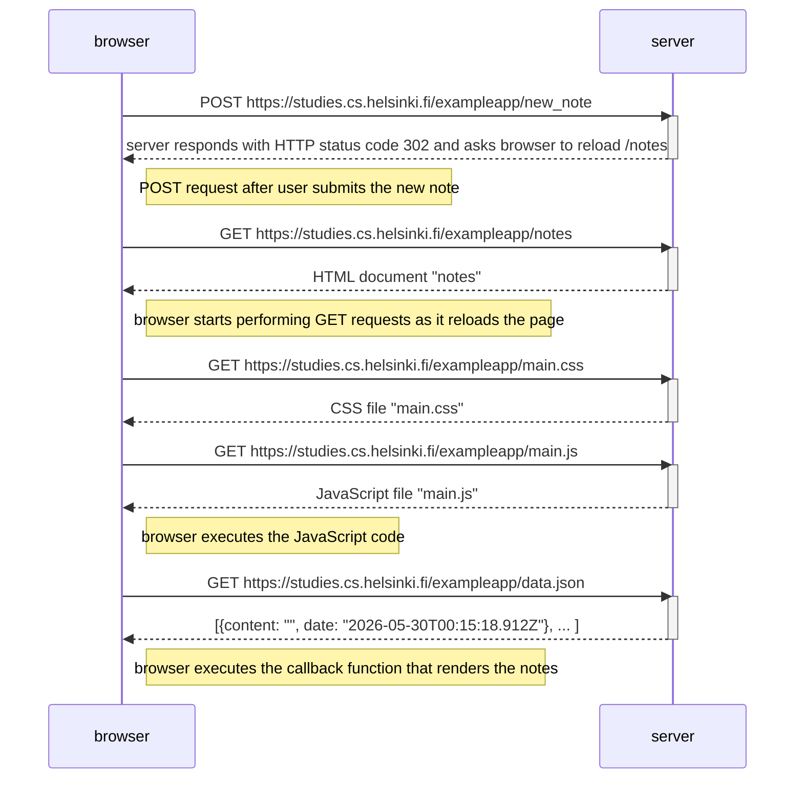

```mermaid
sequenceDiagram
    participant browser
    participant server

    browser->>server: POST https://studies.cs.helsinki.fi/exampleapp/new_note
    activate server
    server-->>browser: server responds with HTTP status code 302 and asks browser to reload /notes
    deactivate server

    Note right of browser: POST request after user submits the new note

    browser->>server: GET https://studies.cs.helsinki.fi/exampleapp/notes
    activate server
    server-->>browser: HTML document "notes"
    deactivate server

    Note right of browser: browser starts performing GET requests as it reloads the page

    browser->>server: GET https://studies.cs.helsinki.fi/exampleapp/main.css
    activate server
    server-->>browser: CSS file "main.css"
    deactivate server

    browser->>server: GET https://studies.cs.helsinki.fi/exampleapp/main.js
    activate server
    server-->>browser: JavaScript file "main.js"
    deactivate server

    Note right of browser: browser executes the JavaScript code

    browser->>server: GET https://studies.cs.helsinki.fi/exampleapp/data.json
    activate server
    server-->>browser: [{content: "", date: "2026-05-30T00:15:18.912Z"}, ... ]
    deactivate server

    Note right of browser: browser executes the callback function that renders the notes
```