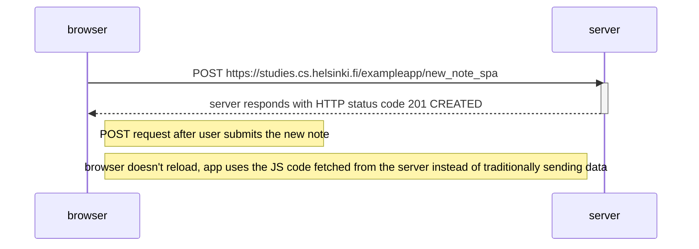

```mermaid
sequenceDiagram
    participant browser
    participant server

    browser->>server: POST https://studies.cs.helsinki.fi/exampleapp/new_note_spa
    activate server
    server-->>browser: server responds with HTTP status code 201 CREATED
    deactivate server

    Note right of browser: POST request after user submits the new note


    Note right of browser: browser doesn't reload, app uses the JS code fetched from the server instead of traditionally sending data
```